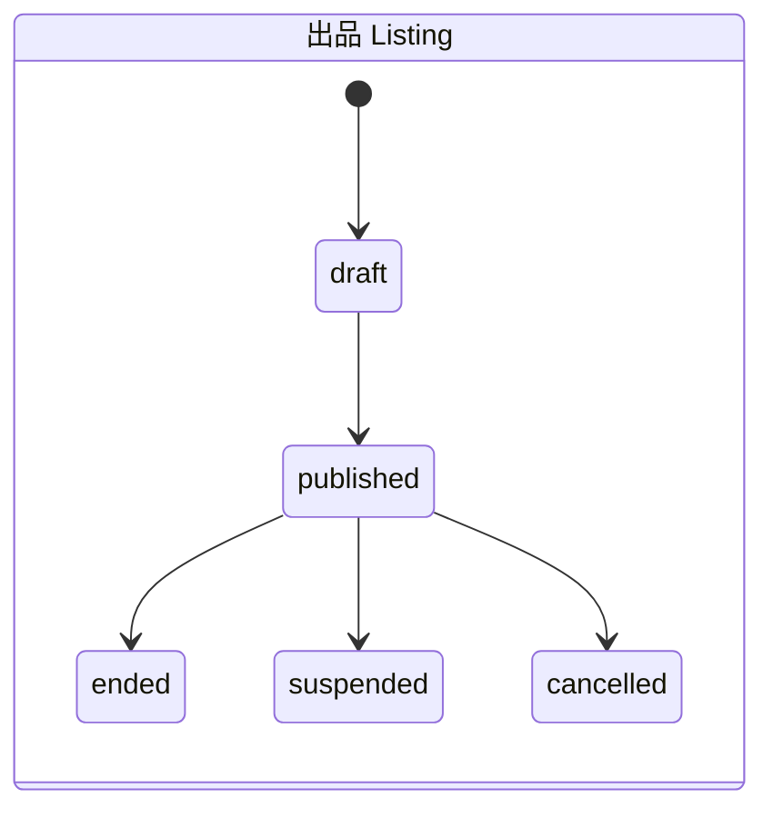

# オークション業務ルール（MVP）

> 出典: AGENTS.md 5章。未決事項は [`open-questions.md`](open-questions.md) を参照。

## 状態遷移

- 出品: `draft -> published -> ended`（必要に応じて `suspended` / `cancelled`）
- オークション: `scheduled -> active -> ended`（例外: `cancelled`）
- 取引: `awaiting_payment -> paid -> shipped -> delivered -> completed`
- 例外的な取引状態: `cancelled` / `disputed` / `refunded`（許可条件は TBD）

## 入札成立条件

- 認証済みかつ利用停止中でないユーザーのみ。
- 自分の出品には入札できない。
- 公開・開催中で、サーバー基準の終了時刻前であること。
- 入札額は開始価格以上。最高入札がある場合は `現在価格 + 最低入札増分` 以上。
- 入札額は正の整数（円）で、サービス上限以下。
- DB トランザクション内で整合性を再確認し、同時入札はロック等で直列化する。
- 入札 API は冪等性キーで二重送信を防ぐ。
- 入札履歴は原則として削除・上書きしない。

## 終了・落札処理

- 終了判定はサーバー時刻と DB 状態で確定する（ワーカーの実行時刻だけに頼らない）。
- 再実行しても `Order` が重複しない（冪等）。
- 入札なし終了と落札あり終了を区別する。
- 終了・落札者確定・`Order` 作成は原子的に行う。
- 通知の失敗で確定状態を巻き戻さない（必要なら Outbox パターン）。

## 最低入札増分

TBD（価格帯ごとのテーブルにするか等）
