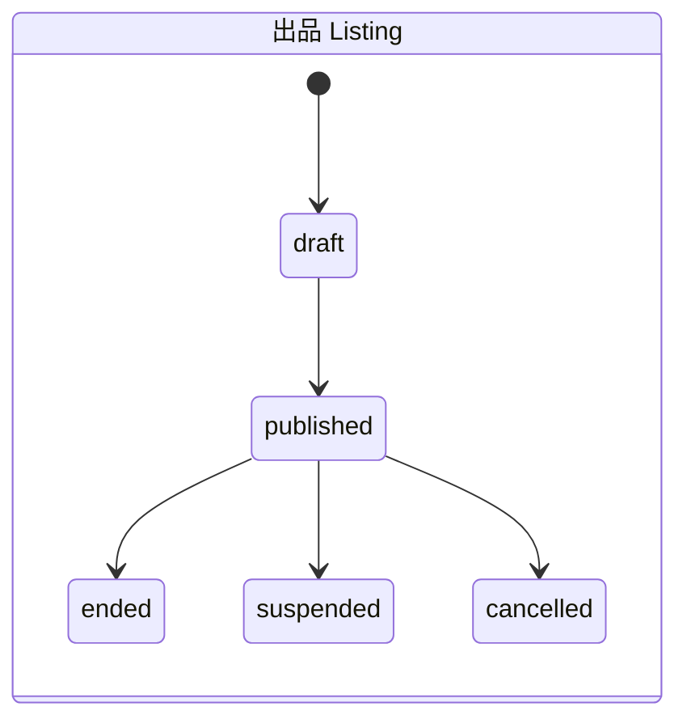

# オークション業務ルール（MVP）

> これは初期ルール案です。未決事項は [`open-questions.md`](open-questions.md) を参照してください。現在の画面はブラウザ内だけで動くデモであり、正式な入札APIやDB処理はありません。

## 用語

- 開始価格: 出品者が設定する最初の入札可能価格。
- 現在価格: 受け付け済み入札の最高額。入札がなければ開始価格を表示上の基準とする。
- 最低入札額: 現在価格に最低入札増分を加えた金額。初回入札では開始価格以上。
- 受付時刻: サーバーが入札を検証・確定した時刻。ブラウザ時計は正式な判定に使わない。

## 状態遷移

- 出品: `draft -> published -> ended`（必要に応じて `suspended` / `cancelled`）
- オークション: `scheduled -> active -> ended`（例外: `cancelled`）
- 取引: `awaiting_payment -> paid -> shipped -> delivered -> completed`
- 例外的な取引状態: `cancelled` / `disputed` / `refunded`（許可条件は未決）

状態変更は許可された遷移だけを受け付け、管理操作や重要な変更は監査対象にします。具体的なキャンセル権限と返金条件は別途決定します。

## 入札成立条件

- 認証済みで、利用停止中ではないユーザーのみ入札できます。
- 自分の出品には入札できません。
- 公開・開催中で、サーバー基準の終了時刻前である必要があります。
- 入札額は開始価格以上です。最高入札がある場合は `現在価格 + 最低入札増分` 以上です。
- 入札額は正の整数JPYで、サービス上限以下です。
- DBトランザクション内で整合性を再確認し、同時入札はロック等で直列化します。
- 入札APIは冪等性キーを使い、二重送信を防ぎます。
- 入札履歴は原則として削除・上書きしません。

## 終了・落札処理

- 終了判定はサーバー時刻とDB状態で確定します（ワーカーの実行時刻だけに頼りません）。
- 終了処理を再実行しても `Order` が重複しないようにします。
- 入札なし終了と落札あり終了を区別します。
- 終了・落札者確定・`Order` 作成は原子的に行います。
- 通知の失敗で確定状態を巻き戻しません（必要に応じてOutboxパターンを使います）。
- 終了時の延長、終了直前の受付境界、同額入札の優先順位は未決です。

## 最低入札増分

価格帯ごとの増分表にするか等は未決です。現在の画面デモでは開始価格が5,000円未満なら100円、以上なら500円を表示に使っています。この値はデモ用の仮置きで、採用済み業務ルールではありません。

## 取引・決済

落札時に購入者、出品者、落札価格、商品タイトル・説明・配送条件のスナップショットを持つ注文を作成する案です。支払期限、キャンセル、返金、配送事故の手順は事業・決済設計を経て決定します。決済機微情報をアプリDBに保存せず、決済成功は検証済みWebhook等のサーバー情報で確定します。

**この文書は決済を許可するものではありません。** 決済事業者・本人確認・返金・紛争・法務の運用準備が整うまで、本番の資金移動を伴う取引を公開しません。
